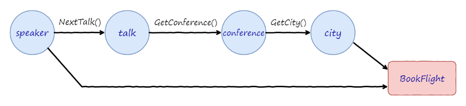

# Swift_Coroutine

Base on [boostorg/context](https://github.com/boostorg/context).

API like [Kotlin/kotlinx.coroutines](https://github.com/Kotlin/kotlinx.coroutines/blob/master/docs/basics.md)

> Note:
>
> Chinese doc: [hltj/kotlinx.coroutines-cn](https://github.com/hltj/kotlinx.coroutines-cn/blob/master/docs/basics.md)

One of project's goal is study `Coroutine` api just once and built for the convenience of the developer from the Java Ecosystem (e.g Java-Web Android ...)

> Note: 
>
> The project can run in Android though it implement by Swift !

API also like Golang maybe maybe maybe.

## Background

Just want to reimplement it again. Swift Ecosystem maybe need `Coroutine` ^_^.

Thanks [boostorg/context](https://github.com/boostorg/context) for making `Coroutine` possible in C C++ and Swift.

And i donot known the assembly programing language, so thanks [boostorg/context](https://github.com/boostorg/context) again, ^_^.


Of course `#include <setjmp.h>` api in Linux can also achieve this job. 

e.g [belozierov/SwiftCoroutine](https://github.com/belozierov/SwiftCoroutine)

**Related Project:**

- [Guang1234567/Swift_Boost_Context](https://github.com/Guang1234567/Swift_Boost_Context) :  A swift wrapper of [boostorg/context](https://github.com/boostorg/context)

## Support

- Android
- MacOS
- Ios
- Linux 

For web app, maybe modify the web framework (e.g [vapor/vapor](https://github.com/vapor/vapor)) to base on `Coroutine` just like [ktorio/ktor](https://github.com/ktorio/ktor) in future.

- Windows 

Not support now, maybe after swift-toolchain-5.3 and the stable `ABI`.

## Usage

API just like [Kotlin/kotlinx.coroutines](https://github.com/Kotlin/kotlinx.coroutines/blob/master/docs/basics.md) but little different. After all, the `extension function`'s syntax not different between `Swift` and `Kotlin`.


### Basic

```swift
func example_01() throws {
    // Example-01
    // ===================
    print("Example-01 =============================")

    //let queue = DispatchQueue(label: "TestCoroutine")
    let queue = DispatchQueue.global()

    let coJob1 = CoLauncher.launch(name: "co1", dispatchQueue: queue) { (co: Coroutine) throws -> String in
        defer {
            print("co 01 - end \(Thread.current)")
        }
        print("co 01 - start \(Thread.current)")
        try co.yield()
        return "co1 's result"
    }

    let coJob2 = CoLauncher.launch(dispatchQueue: queue) { (co: Coroutine) throws -> String in
        defer {
            print("co 02 - end \(Thread.current)")
        }
        print("co 02 - start \(Thread.current)")
        try co.yield()
        throw TestError.SomeError(reason: "Occupy some error in co2")
        return "co2 's result"
    }

    let coJob3 = CoLauncher.launch(dispatchQueue: queue) { (co: Coroutine) throws -> String in
        defer {
            print("co 03 - end \(Thread.current)")
        }
        print("co 03 - start \(Thread.current)")
        try co.yield()
        return "co3 's result"
    }

    try coJob1.join()
    try coJob2.join()
    try coJob3.join()

    print("Example-01 =============  end  ===============")
}
```

**output**

```ruby
Example-01 =============================
co 01 - start <NSThread: 0x7f9e3c004600>{number = 3, name = (null)}
co 02 - start <NSThread: 0x7f9e3a4060f0>{number = 2, name = (null)}
co 03 - start <NSThread: 0x7f9e3c104120>{number = 4, name = (null)}
co 01 - end <NSThread: 0x7f9e3a4060f0>{number = 2, name = (null)}
co 03 - end <NSThread: 0x7f9e3c004600>{number = 3, name = (null)}
co 02 - end <NSThread: 0x7f9e3c104120>{number = 4, name = (null)}
Example-01 =============  end  ===============
```


### Delay (Non-Blocking)

```swift
func example_03() throws {
    // Example-03
    // ===================
    print("Example-03 =============================")

    //let queue = DispatchQueue(label: "TestCoroutine")
    let queue = DispatchQueue.global()

    let coDelay = CoLauncher.launch(dispatchQueue: queue) { (co: Coroutine) throws -> String in
        print("coDelay - start \(Thread.current)")
        let start = CFAbsoluteTimeGetCurrent()
        try co.delay(.seconds(2))
        let end = CFAbsoluteTimeGetCurrent()
        print("coDelay - end \(Thread.current)  in \((end - start) * 1000) ms")
        return "coDelay 's result"
    }

    try coDelay.join()
}
```

**output**

```ruby
Example-03 =============================
coDelay - start <NSThread: 0x7fe15fd0db40>{number = 2, name = (null)}
coDelay - end <NSThread: 0x7fe15fc040a0>{number = 3, name = (null)}  in 2191.501021385193 ms
```

### continueOn (Non-Blocking)

Are you envious of `observeOn` in `Rxswift` and `Rxjava` 

or [withContext ](https://kotlin.github.io/kotlinx.coroutines/kotlinx-coroutines-core/kotlinx.coroutines/with-context.html) in `kotlin-coroutines`?

`Swift-Couroutine` also has `continueOn` to instead of them.

It's inspiration from [Arrow Fx](https://arrow-kt.io/docs/0.10/fx/async/#dispatchers-and-contexts) a kotlin FP framework.

```swift
func example_06() throws {
    // Example-06
    // ===================
    print("Example-06 =============================")

    let queue = DispatchQueue.global()
    let queue_001 = DispatchQueue(label: "queue_001", attributes: .concurrent)
    let queue_002 = DispatchQueue(label: "queue_002", attributes: .concurrent)

    queue.async {
        Thread.sleep(forTimeInterval: 0.005)
        print("other job \(Thread.current)")
    }

    let coJob1 = CoLauncher.launch(name: "co1", dispatchQueue: queue) { (co: Coroutine) throws -> String in
        defer {
            print("co 01 - end \(Thread.current)")
        }
        print("co 01 - start \(Thread.current)")
        try co.continueOn(queue_001)
        print("co 01 - continueOn - queue_001 -  \(Thread.current)")
        try co.continueOn(DispatchQueue.main)
        print("co 01 - continueOn - queue_main -  \(Thread.current)")
        try co.continueOn(queue_002)
        print("co 01 - continueOn - queue_002 -  \(Thread.current)")
        try co.continueOn(queue)

        return "co1 's result"
    }

    try coJob1.join()

    Thread.sleep(forTimeInterval: 1)
}
```

**output**

```ruby
Example-06 =============================
co 01 - start <NSThread: 0x7ff43d704600>{number = 2, name = (null)}
co 01 - continueOn - queue_001 -  <NSThread: 0x7ff43d410500>{number = 3, name = (null)}
co 01 - continueOn - queue_main -  <NSThread: 0x7ff43d410050>{number = 1, name = main}
co 01 - continueOn - queue_002 -  <NSThread: 0x7ff43d705c30>{number = 4, name = (null)}
co 01 - end <NSThread: 0x7ff43d705f30>{number = 5, name = (null)}
other job <NSThread: 0x7ff43f1040c0>{number = 6, name = (null)}
```


### Channel (Non-Blocking)


```swift
func example_05() throws {
    // Example-05
    // ===================
    print("Example-05 =============================")

    let producerQueue = DispatchQueue(label: "producerQueue", attributes: .concurrent)
    let consumerQueue = DispatchQueue(label: "consumerQueue", attributes: .concurrent)
    let closeQueue = DispatchQueue(label: "closeQueue", attributes: .concurrent)
    let channel = CoChannel<Int>(capacity: 7)

    let coClose = CoLauncher.launch(name: "coClose", dispatchQueue: closeQueue) { (co: Coroutine) throws -> Void in
        print("coClose before  --  delay")
        try co.delay(.milliseconds(10))
        //try co.yield()
        print("coClose after  --  delay")
        channel.close()
        print("coClose  --  end")
    }

    let coConsumer = CoLauncher.launch(name: "coConsumer", dispatchQueue: consumerQueue) { (co: Coroutine) throws -> Void in
        var time: Int = 1
        for item in try channel.receive(co) {
            print("consumed : \(item)  --  \(time)  --  \(Thread.current)")
            time += 1
        }
    }

    let coProducer01 = CoLauncher.launch(name: "coProducer01", dispatchQueue: producerQueue) { (co: Coroutine) throws -> Void in
        for time in (1...32).reversed() {
            //print("coProducer01  --  before produce : \(time)")
            try channel.send(co, time)
            print("coProducer01  --  after produce : \(time)")
            try co.delay(.milliseconds(1))
        }
        print("coProducer01  --  end")
    }

    /*let coProducer02 = CoLauncher.launch(name: "coProducer02", dispatchQueue: producerQueue) { (co: Coroutine) throws -> Void in
        for time in (33...50).reversed() {
            //print("coProducer02  --  before produce : \(time)")
            try channel.send(co, time)
            print("coProducer02  --  after produce : \(time)")
        }
        print("coProducer02  --  end")
    }*/

    try coClose.join()
    try coConsumer.join()
    try coProducer01.join()
    //try coProducer02.join()

    print("channel = \(channel)")
}
```

**output**

```ruby
Example-05 =============================
coClose before  --  delay
coProducer01  --  after produce : 32
consumed : 32  --  1  --  <NSThread: 0x7f8b72f04160>{number = 3, name = (null)}
coProducer01  --  after produce : 31
consumed : 31  --  2  --  <NSThread: 0x7f8b72e04600>{number = 2, name = (null)}
coProducer01  --  after produce : 30
consumed : 30  --  3  --  <NSThread: 0x7f8b72e04600>{number = 2, name = (null)}
coProducer01  --  after produce : 29
consumed : 29  --  4  --  <NSThread: 0x7f8b72e04600>{number = 2, name = (null)}
coProducer01  --  after produce : 28
consumed : 28  --  5  --  <NSThread: 0x7f8b748040f0>{number = 4, name = (null)}
coProducer01  --  after produce : 27
consumed : 27  --  6  --  <NSThread: 0x7f8b748040f0>{number = 4, name = (null)}
coProducer01  --  after produce : 26
consumed : 26  --  7  --  <NSThread: 0x7f8b72e04600>{number = 2, name = (null)}
coProducer01  --  after produce : 25
consumed : 25  --  8  --  <NSThread: 0x7f8b72f04160>{number = 3, name = (null)}
coClose after  --  delay
coClose  --  end
channel = CoChannel(_name: Optional("ObjectIdentifier(0x00007f8b748b03c0)"), _isClosed: true, _semFull: CoSemaphore(_count: 7), _semEmpty: CoSemaphore(_count: 0))
```

### Future (Non-Blocking)

 A workflow step might need data from two or more previous steps combined.
In the example below, bookFlight method might actually needs both Speaker and City objects:
 
 
 
 > Picture is copied from https://arrow-kt.io/docs/0.9/patterns/monads/

```swift

func loadSpeaker() -> CoFuture<Speaker> {
    return CoFuture(name, DispatchQueue.IO) { (co: Coroutine) in
        // running on  "IO"  thread
    }
}

func nextTalk() -> CoFuture<Talk> {
    return CoFuture(name, DispatchQueue.Single) { (co: Coroutine) in
        // running on  "Single"  thread
    }
}

func getConference() -> CoFuture<Conference> {
    return CoFuture(name, DispatchQueue.Net) { (co: Coroutine) in
       // running on  "Net"  thread
    }
}

func getCity() -> CoFuture<City> {
    return CoFuture(name, DispatchQueue.main) { (co: Coroutine) in
       // running on  "Main"  thread
    }
}

```

```swift
func workflow() throws -> Void {
    let speaker = try repository.loadSpeaker().await()
    let talk = try speaker.nextTalk().await()
    let conference = try talk.getConference().await()
    let city = try conference.getCity().await()

    // needs both Speaker and City objects
    reservations.bookFlight(speaker, city).await()
}
```

Just like the `RxJava` `RxSwift` 's `observeOn` operator,

`CoFuture` also convenient for `thread switch`.

```java

// java
// ===================


Observable<Integer> observable = Observable.create(new ObservableOnSubscribe<Integer>() {
            @Override
            public void subscribe(ObservableEmitter<Integer> observableEmitter) throws Exception {
                // ...
            }
        });
        observable.subscribeOn(Schedulers.newThread())
                .observeOn(Schedulers.io())
                .map(new Function<Integer, Integer>() {
                    // ...
                })
                .observeOn(AndroidSchedulers.mainThread())
                .doOnSubscribe(new Consumer<Disposable>() {
                    // ...
                })
                .subscribeOn(Schedulers.single())
                .subscribe(new Consumer<Integer>() {
                    // ...
                });


```


Just like the `kotlin-coroutines` 's [suspend](https://github.com/hltj/kotlinx.coroutines-cn/blob/master/docs/composing-suspending-functions.md) function and [withContext ](https://kotlin.github.io/kotlinx.coroutines/kotlinx-coroutines-core/kotlinx.coroutines/with-context.html),

`CoFuture` also convenient for `thread switch`.

```kotlin

// kotlin
// ===================


suspend func loadSpeaker() : Result<Speaker> {
    withContext(Dispatchers.IO) {
        // running on  "IO"  thread
    }
}

suspend func nextTalk() : Result<Talk> {
    withContext(Dispatchers.Default) {
            // running on  "New"  thread
    }
}

suspend func getConference() : Result<Conference> {
     withContext(Dispatchers.IO) {
            // running on  "IO"  thread
        }
}

suspend func getCity() : Result<City> {
     withContext(Dispatchers.Main) {
            // running on  "Main"  thread
        }
}

```